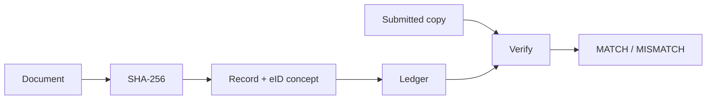

<div align="center">

# Blockchain-Inspired Document Notarization + eID Concepts

### Cryptography · Integrity · Digital Identity · Audit Ledger

[](https://www.python.org/)
[](src/hasher.py)
[](Dockerfile)
[](LICENSE)

**Portfolio security / identity system** by [Amaragani Nikhil Sai](https://github.com/nikhilamaragani-jpg)  
Runnable integrity workflow. SQLite ledger demo — not a mainnet smart-contract deployment.

</div>

---

## Problem

Paper notarization is slow, hard to verify remotely, and weak for audit trails. Digital documents need **tamper-evident fingerprints**, **identity-linked records**, and **fast verification**.

---

## Solution

A **blockchain-inspired autonomous notarization prototype**:

1. Hash document content (SHA-256)  
2. Create a notarization record (owner / eID concept, timestamp, status)  
3. Persist to a ledger store (SQLite demo)  
4. Re-hash to verify MATCH / MISMATCH  

Industry mentoring: **Conscience Technologies** (Apr–May 2025).

---

## Features

- Deterministic SHA-256 fingerprints  
- Notarization record model  
- Integrity verification demo (valid + tampered)  
- Ledger listing  
- Dockerized demo run  
- Unit tests for hashing / verify  

---

## Architecture

```text
Document bytes/text
      |
      v
SHA-256 fingerprint
      |
      v
Notarization record (owner, name, hash, time, status)
      |
      v
Ledger store (SQLite demo)  ---->  Verify: re-hash compare
```



---

## Tech stack

| Area | Technology |
|------|------------|
| Language | Python 3 |
| Crypto | hashlib SHA-256 |
| Storage | SQLite ledger |
| Packaging | Docker |
| Quality | pytest |
| Roadmap | Web3 contracts, PKI/eID, Django UI |

---

## Folder structure

```text
.
├── README.md
├── LICENSE
├── requirements.txt
├── Dockerfile
├── docker-compose.yml
├── src/
│   ├── main.py
│   ├── hasher.py
│   ├── notarization.py
│   └── database.py
├── tests/
├── docs/
├── data/
└── images/
```

---

## Installation

```bash
git clone https://github.com/nikhilamaragani-jpg/blockchain-autonomous-notarization-e-id.git
cd blockchain-autonomous-notarization-e-id
pip install -r requirements.txt
```

---

## Usage

```bash
python src/main.py
pytest -q
docker compose up --build
```

---

## Project workflow

1. Prepare document text  
2. Generate hash  
3. Attach owner / demo eID metadata  
4. Write ledger row  
5. Verify original (MATCH) and tampered (MISMATCH)  

---

## Screenshots

See `images/README.md` for capture checklist (CLI verify output).

---

## Results

| Capability | Status |
|------------|--------|
| Hash + record + verify | Implemented |
| Ledger snapshot | Implemented |
| On-chain smart contracts | Roadmap |
| Real national eID / PKI | Roadmap |

---

## Future improvements

- [ ] Ethereum/testnet notary contract  
- [ ] Real PKI signature binding  
- [ ] REST API for verify endpoints  
- [ ] Immutable object storage for originals (hash-only on chain)  

---

## Skills demonstrated

Applied cryptography basics · integrity design · digital identity concepts · modular Python · honest security scoping · Docker demos

---

## Documentation

[PROJECT_BRIEF](docs/PROJECT_BRIEF.md) · [DEMO](docs/DEMO.md) · [INTERVIEW](docs/INTERVIEW.md) · [RESUME_BULLETS](docs/RESUME_BULLETS.md) · [ABOUT_TOPICS](docs/ABOUT_TOPICS.md)

## License

MIT

**Author:** Amaragani Nikhil Sai · https://nikhilamaragani-jpg.github.io/
