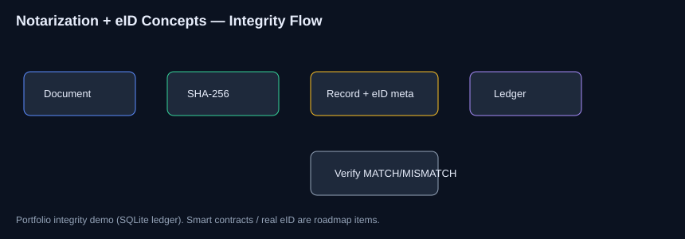

<div align="center">

# Blockchain-Based Autonomous Notarization + eID Concepts

### B.Tech Mini Project · Cryptography · Digital Identity · Ledger Demo

[](https://www.python.org/)
[](Dockerfile)
[](LICENSE)

**Amaragani Nikhil Sai** · B.Tech CSE · SIIET (JNTUH)  
Industry mentoring: Conscience Technologies (Apr–May 2025). SQLite ledger demo — not a mainnet deployment.

</div>

---

## Problem

Traditional notarization is often physical, slow, and hard to verify remotely. This mini project explores cryptographic document fingerprints, identity-oriented metadata, and integrity verification.

---

## Solution

A blockchain-inspired integrity prototype: hash → notarize record (eID-oriented metadata) → ledger store → verify MATCH/MISMATCH.

---

## Features

- SHA-256 fingerprints  
- Notarization records  
- Integrity verification demo  
- Ledger listing  
- Docker + CI tests  

---

## Architecture



---

## Tech stack

Python · hashlib · SQLite · Docker · pytest

---

## Folder structure

```text
src/ tests/ docs/ data/ images/ scripts/ config/
Dockerfile docker-compose.yml requirements.txt
```

---

## Installation

```bash
git clone https://github.com/nikhilamaragani-jpg/blockchain-autonomous-notarization-e-id.git
cd blockchain-autonomous-notarization-e-id
pip install -r requirements.txt
```

---

## Usage

```bash
python src/main.py
pytest -q
docker compose up --build
```

---

## Project workflow

1. Hash document  
2. Create record with owner/eID metadata  
3. Persist ledger row  
4. Verify original vs tampered  

---

## Screenshots

Architecture: [images/architecture.svg](images/architecture.svg)  
Capture CLI MATCH/MISMATCH to `images/cli_demo.png`.

---

## Results

Demo proves hash stability and mismatch detection. On-chain contracts are roadmap only (honest scope).

---

## Future improvements

- [ ] Testnet smart contract notary  
- [ ] Real PKI / eID binding  
- [ ] REST verify API  

---

## Skills demonstrated

Applied cryptography · integrity design · digital identity concepts · modular Python · Docker · honest scoping

---

## Documentation

[PROJECT_BRIEF](docs/PROJECT_BRIEF.md) · [DEMO](docs/DEMO.md) · [INTERVIEW](docs/INTERVIEW.md) · [RESUME_BULLETS](docs/RESUME_BULLETS.md)

## License

MIT · **Author:** Amaragani Nikhil Sai · B.Tech CSE · https://nikhilamaragani-jpg.github.io/
