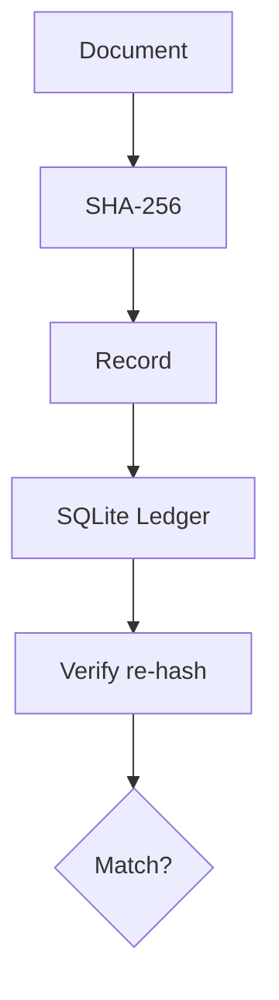

# Demo walkthrough

```bash
pip install -r requirements.txt
python src/main.py
```

```text
[1] Hashing document (SHA-256)
[2] Creating notarization record
[3] Verify original → MATCH
[4] Verify tampered → MISMATCH
[5] Ledger snapshot
```


