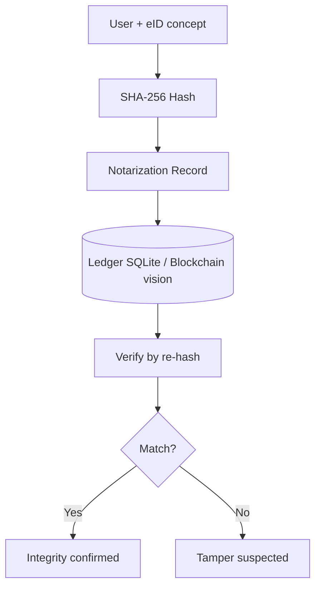

# Demo Walkthrough — BANS Notarization Prototype

## Expected flow

```text
============================================================
 Blockchain Autonomous Notarization (BANS) Prototype
 Hash · Record · Verify · Ledger
============================================================
1) Create notarization record
2) Verify document integrity
...
Record stored with SHA-256 fingerprint + timestamp
Verification: MATCH / MISMATCH
```

## Architecture


